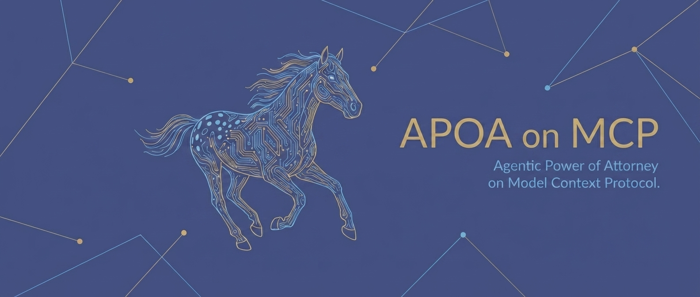

[](https://github.com/agenticpoa/apoa)

# @apoa/mcp

APOA authorization for [MCP](https://modelcontextprotocol.io) servers. Per-tool-call scoping, delegation chains, audit trails.

MCP has OAuth 2.1 for connection-level auth (who can connect). This package adds action-level auth (what they can do once connected).

```
MCP Client --> @apoa/mcp --> MCP Server
               (authorize every tool call)
```

## Two Modes

### Middleware (for servers you build)

```typescript
import { Server } from '@modelcontextprotocol/sdk/server/index.js';
import { withAPOA } from '@apoa/mcp';

const server = new Server({ name: 'my-server', version: '1.0.0' }, { capabilities: { tools: {} } });

withAPOA(server, {
  key: publicKey,
  mappings: {
    read_file:  'filesystem:files:read',
    write_file: 'filesystem:files:write',
    list_dir:   'filesystem:dirs:list',
  },
});
```

Three lines. Every tool call is authorized against an APOA token passed in `_meta.apoa_token`. No token, no access.

### Proxy (for third-party servers you can't modify)

```bash
npx apoa-mcp --config gateway.config.json
```

Sits between client and server, intercepts every `tools/call`, authorizes, strips the token, forwards.

## How It Works

1. MCP client passes an APOA token in `_meta.apoa_token` on every tool call
2. The tool name is mapped to an APOA `service:scope` pair
3. The token is verified (signature, expiration, revocation, replay)
4. The SDK's `authorize()` checks scope, constraints, and rules
5. If authorized, the tool runs. If not, the client gets a denial with a reason.

The token is stripped before reaching the tool handler -- the tool never sees it.

## Passing Tokens

MCP clients include the APOA token in the `_meta` field:

```json
{
  "method": "tools/call",
  "params": {
    "name": "read_file",
    "arguments": {
      "path": "/tmp/test.txt",
      "_meta": {
        "apoa_token": "eyJhbGciOiJFZERTQSIs..."
      }
    }
  }
}
```

## Tool Mappings

**Simple format** (one string per tool):
```typescript
withAPOA(server, {
  key: publicKey,
  mappings: {
    read_file:  'filesystem:files:read',
    write_file: 'filesystem:files:write',
  },
});
```

**Auto-mapping** (no config needed):
```typescript
withAPOA(server, { key: publicKey });
// read_file -> read_file:call, write_file -> write_file:call, etc.
```

**Conditional mappings** (argument-aware):
```json
{
  "toolMappings": [
    { "tool": "write_file", "service": "filesystem", "scope": "files:write:sandbox",
      "when": { "path": { "startsWith": "/tmp" } }, "priority": 10 },
    { "tool": "write_file", "service": "filesystem", "scope": "files:write" }
  ]
}
```

## apoa.check (Dry-Run Tool)

Enable it to inject a debugging tool that checks authorization without executing:

```typescript
withAPOA(server, { key: publicKey, enableCheckTool: true });
```

Agents or humans can call `apoa.check({ tool: 'write_file', path: '/home/data' })` to see whether the action would be authorized, what scope it maps to, and which rule would fire.

## What This Adds to MCP

| Capability | MCP Native | @apoa/mcp |
|---|---|---|
| Connection-level auth (OAuth 2.1) | Yes | N/A (complementary) |
| Per-tool-call authorization | No (SEP-1880 closed as NOT_PLANNED) | Yes |
| Delegation chains with attenuation | No | Yes (via @apoa/core) |
| Hard/soft rules engine | No | Yes |
| Constraint checking per action | No | Yes |
| Cascade revocation | No | Yes |
| Audit trail | No (roadmap "pre-RFC") | Yes (hash-chained, tamper-evident) |
| Replay protection | No | Yes (JTI-based) |

## Persistent Stores

For production, use SQLite stores instead of the default in-memory stores:

```typescript
import { SqliteRevocationStore, SqliteAuditStore, SqliteReplayStore } from '@apoa/mcp';

withAPOA(server, {
  key: publicKey,
  revocationStore: new SqliteRevocationStore('./auth.db'),
  auditStore: new SqliteAuditStore('./auth.db'),
  replayStore: new SqliteReplayStore('./auth.db'),
});
```

The audit store uses SHA-256 hash chaining for tamper evidence.

## Development

```bash
pnpm install
pnpm test          # Run tests
pnpm run typecheck # Type check
pnpm run build     # Build
```

## License

Apache-2.0

## Part of the APOA Standard

- [APOA Spec](https://github.com/agenticpoa/apoa/blob/main/SPEC.md)
- [@apoa/core](https://github.com/agenticpoa/apoa/tree/main/sdk) (TypeScript SDK)
- [apoa](https://pypi.org/project/apoa/) (Python SDK)
